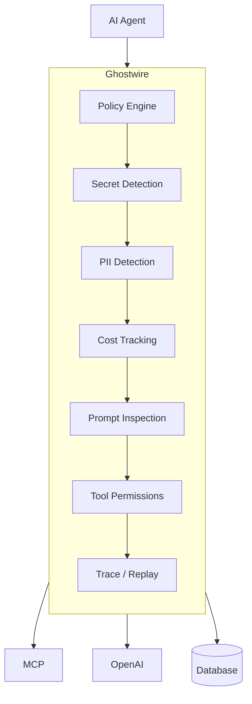

# Ghostwire AI-agent gateway architecture

> [!IMPORTANT]
> Ghostwire is currently an architecture proposal. The repository's runnable
> functionality is Timewarp event ingestion, trace reconstruction, and
> recorded HTTP replay; it does not yet proxy or enforce AI-agent traffic.

Ghostwire is the policy and observability boundary between an AI agent and the
systems it can reach. Every model request, tool call, and connector response
crosses the gateway before it is allowed to continue.

## Request flow

1. The agent sends an operation to Ghostwire rather than directly to a
   provider or tool.
2. The policy engine identifies the caller, operation, destination, and
   applicable policy version.
3. Secret, PII, and prompt inspection classify the content. A policy can deny
   the operation, redact fields, or allow it unchanged.
4. Cost tracking checks the operation against the caller's budget before a
   billable request is dispatched.
5. Tool permissions authorize the exact connector and action. Permission to
   use one tool never implies permission to use another action or destination.
6. Ghostwire records the decision and sanitized request, invokes the selected
   connector, then applies the same inspection policy to its response.
7. Trace data can be inspected or replayed without bypassing the policy
   boundary.

## Enforcement contract

- **Default deny:** unknown callers, connectors, actions, and policy versions
  are rejected.
- **Fail closed:** inspection or authorization failures prevent dispatch.
- **Least privilege:** tool grants are scoped to identity, action,
  destination, and lifetime.
- **Data minimization:** raw secrets and disallowed PII are neither forwarded
  nor persisted. Detection findings retain locations and classifications, not
  sensitive values.
- **Budget before dispatch:** estimated cost is reserved before provider calls;
  actual usage reconciles the reservation afterward.
- **Auditable decisions:** traces record the policy version, decision, reason,
  connector, timing, and usage while keeping protected content redacted.
- **Safe replay:** replay uses recorded responses by default and cannot contact
  a live dependency unless a policy explicitly permits it.

## Connector boundary

MCP servers, model providers such as OpenAI, and databases are adapters behind
one connector interface. An adapter is responsible only for protocol
translation and usage reporting; it cannot make policy decisions. This keeps
authorization and inspection behavior consistent as destinations are added.

The existing Timewarp event protocol, collector, graph reconstruction, and
recorded-response replay provide the trace/replay foundation. The remaining
Ghostwire controls should be introduced ahead of connector dispatch so that a
denied operation cannot produce an external side effect.

## What is required before production use

The diagram describes the target boundary, not the current implementation. A
usable first release requires the following work, in dependency order.

### 1. Runnable gateway

- Define a versioned request/response envelope containing caller identity,
  connector, action, content, estimated usage, and trace context.
- Add a `ghostwire serve` entry point with authentication, request size and
  timeout limits, health/readiness endpoints, and graceful shutdown.
- Implement one end-to-end connector first. An OpenAI-compatible HTTP
  connector is the smallest useful vertical slice; MCP and database adapters
  can follow after the enforcement path is stable.

**Exit criterion:** an authenticated client can send one model request through
Ghostwire, while direct connector access can be disabled at the network layer.

### 2. Policy and permission enforcement

- Define a versioned policy format with explicit defaults and startup
  validation.
- Evaluate caller, connector, action, destination, and environment before any
  external request.
- Add scoped tool grants, denial reason codes, and tests proving unknown or
  malformed inputs fail closed.

**Exit criterion:** integration tests prove that allowed requests reach the
connector and denied requests cause no external side effects.

### 3. Content protection

- Add secret detectors with configurable rules and redaction.
- Add PII classification suitable for the deployment's languages and
  regulatory requirements.
- Inspect both requests and responses, including streaming chunks and tool
  arguments, before forwarding or persistence.
- Define encrypted handling and retention rules for any payload content that
  policy permits Ghostwire to store.

**Exit criterion:** a test corpus demonstrates expected detection quality and
confirms that blocked values never appear in connector requests, logs, traces,
or error messages.

### 4. Budgets and usage accounting

- Maintain provider/model pricing configuration and normalize token or unit
  usage reported by connectors.
- Reserve estimated cost atomically before dispatch, reject exhausted budgets,
  and reconcile reservations with actual usage.
- Define behavior for streams, retries, connector errors, and missing provider
  usage data.

**Exit criterion:** concurrent requests cannot exceed a configured hard budget,
and every dispatched request has a reconciled usage record.

### 5. Safe traces and replay

- Extend the Timewarp protocol with policy decision, connector, usage, and
  redaction metadata without storing protected values.
- Correlate gateway operations, streaming events, and tool calls into one
  causal trace.
- Require a separate authorization for replay and keep recorded-only replay as
  the default.

**Exit criterion:** an operator can explain why a request was allowed or
denied, inspect its cost, and replay it without contacting a live dependency.

### 6. Operational hardening

- Add structured audit logs, metrics, alerts, and administrative access
  controls.
- Add persistent migrations, backup/restore, retention, deletion, and key
  rotation procedures.
- Add rate limiting, bounded queues, retry policies, circuit breakers, and
  dependency isolation.
- Threat-model prompt injection, SSRF, confused-deputy access, replay abuse,
  policy rollback, and trace-data exfiltration.
- Publish deployment guidance that ensures agents cannot bypass Ghostwire.

**Exit criterion:** load, failure, security, migration, and recovery tests pass
in a staging environment that matches production topology.

## Smallest usable milestone

The recommended first milestone is intentionally narrow: one authenticated
client, one OpenAI-compatible connector, static default-deny policies, scoped
model permission, secret redaction, a hard per-client budget, and sanitized
Timewarp traces. MCP, database tools, advanced PII models, and live replay
should remain disabled until this vertical slice passes the exit criteria
above.
